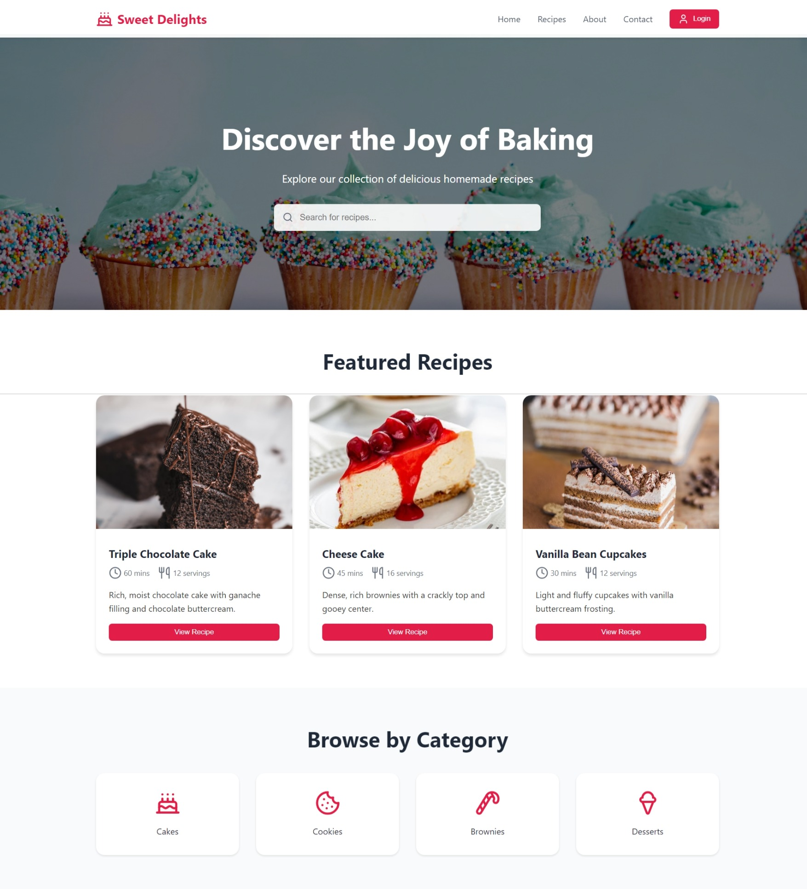
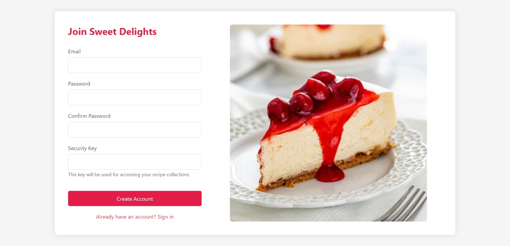
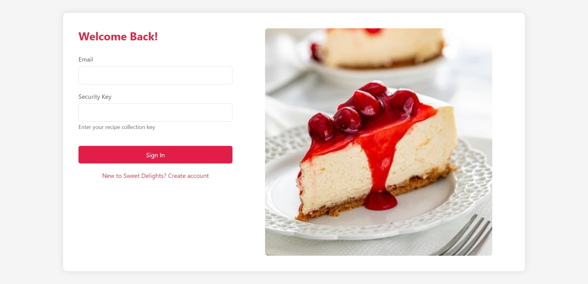
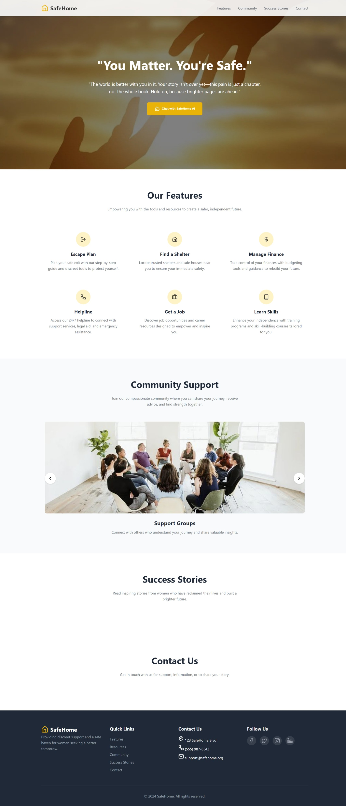
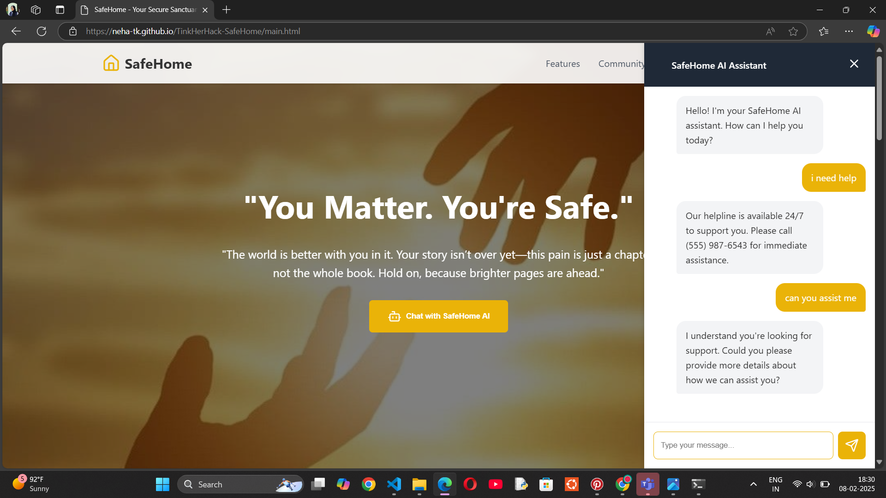
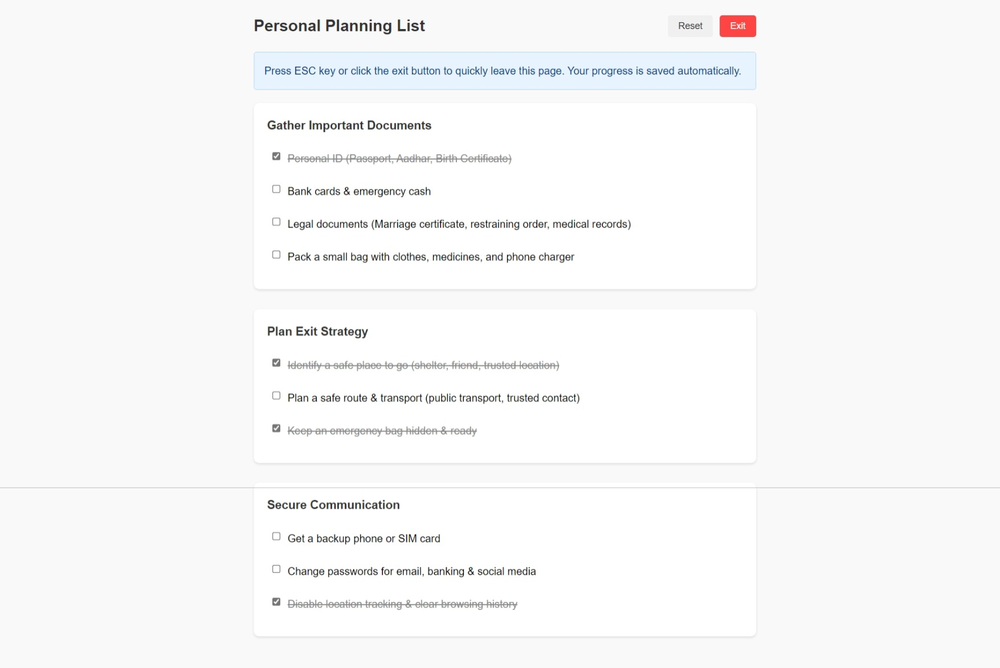
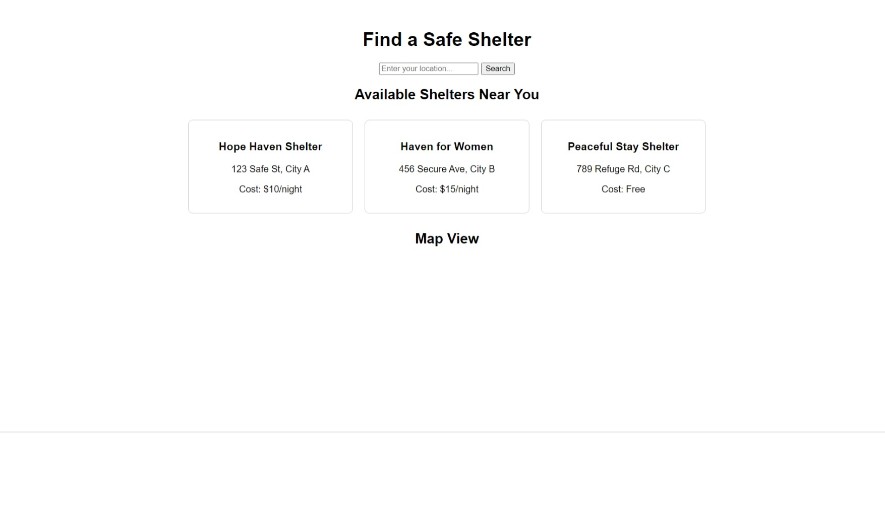
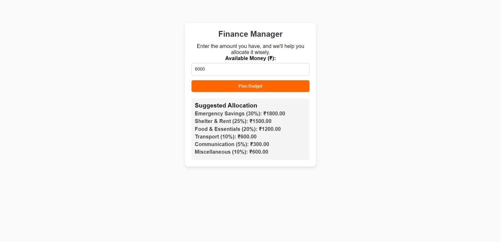
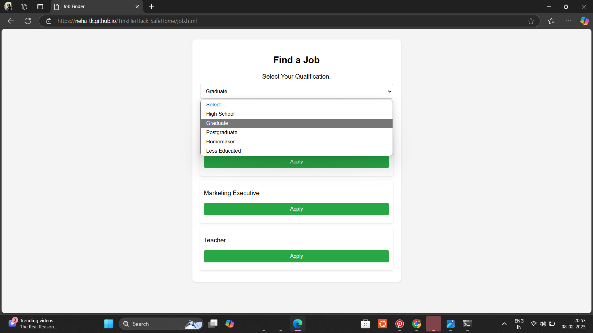
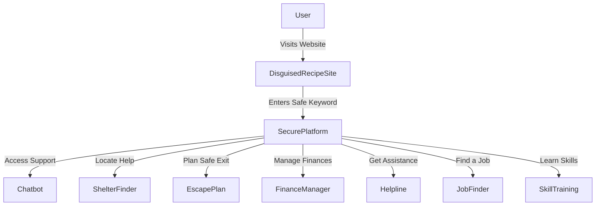

# *Safe Home*  

## *Team Name:* Bytes  

## *Team Members*  
- *Neha TK* - Government Engineering College Kozhikode
- *Fathima Varsha PT* - Government Engineering College Kozhikode  

## *Hosted Project Link*  
https://neha-tk.github.io/TinkHerHack-SafeHome/ 

## *Project Description*  
Safe Home is a discreet online platform designed to support women trapped in abusive relationships. The website initially appears as a normal shopping or recipe platform, but entering a specific keyword unlocks a secure space with mental health support, legal aid, financial resources, an AI-powered therapy chatbot, and access to a supportive community.  

## *The Problem Statement*  
Many women suffering from abuse cannot seek help due to fear, financial dependence, or being monitored by their abuser. This lack of access to support often leads to distress, depression, and even self-harm. Safe Home provides a hidden yet accessible way for women to find guidance and assistance without raising suspicion.  

## *The Solution*  
Safe Home presents itself as an innocent website, but upon entering a secret keyword, users gain access to a secure platform offering mental health support, legal aid, financial resources, and community engagement. The integrated AI chatbot, powered by *Gemini API*, offers therapy-like interactions to provide emotional support.  

---

## *Technical Details*  

### *Technologies/Components Used*  
#### *For Software:*  
- *Languages:* HTML, CSS, JavaScript, Python  
- *Frameworks:* Flask (for backend and chatbot)  
- *Libraries:* Gemini API (for AI chatbot)  
- *Tools:* Google Maps API or OpenStreetMap (for shelter locations)  

---

## *Implementation*  

### *For Software:*  
#### *Installation:*  
```bash
git clone https://github.com/Neha-TK/TinkHerHack-SafeHome
cd TinkHerHack-SafeHome
```

#### *Run:*  
#### *Run the Web App:*  
Open in Browser: [Safe Home](https://neha-tk.github.io/TinkHerHack-SafeHome/)  

#### *Run the Chatbot Locally:*  
```bash
python app.py
```

---

## *Project Documentation*  

### *Screenshots:*  

-  Homepage disguised as a recipe website

- 
-  Entering a secret keyword unlocks the real site

-  Home page

-   AI chatbot interface

-  Personal Planning List

-  Find a Safe Shelter

-  Finance Manager

-  Find a job according to your qualification


### *Diagrams:*  
- Workflow System architecture showing website disguise, secure redirection, and user interactions  
- **Platform Features Workflow:** 



## *Project Demo*  

### *Video:*  
[Watch video](https://www.youtube.com/watch?v=aOLilTYfNwM)     
The video showcases how a user navigates Safe Home, from disguised entry to accessing support features.  

---

## *Team Contributions*  
- *Neha TK & Fathima Varsha PT:* Shared responsibilities in frontend development, backend implementation, chatbot integration, and overall system design.
